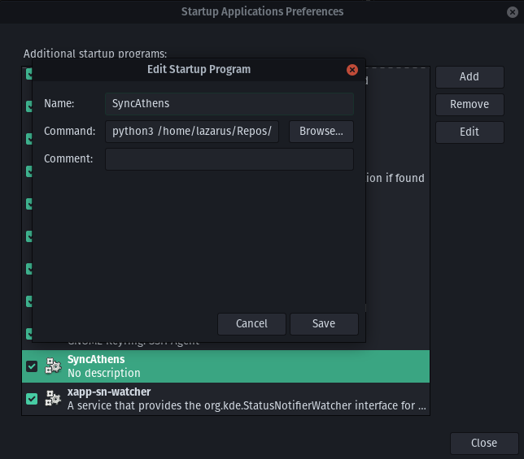

# AthensSyncer
Athens is a great tool for taking notes and organising knowldge. But it is a bummer that you cannot use it accross multiple devices. Well no more this aggressive script will get the job done albeit not in the prettiest fashion.

## Operation
You can setup this syncing to happen automatically on startup and keep on happening as you make changes to your notes but there are some steps you must take first to get things setup first, these are:

##### Make sure to change the paths as appropriate for your machine

1. Setup a repo on github (or any remote version control using Git)
   * If you don't know how to do this check [here](https://docs.github.com/en/get-started/quickstart/create-a-repo) for some guidance
1. Setup git in your CLI so that you are able to commit, push, etc. 
   * If you don't know how to do this look [here](https://docs.github.com/en/get-started/quickstart/set-up-git) or [here](https://docs.gitlab.com/ee/gitlab-basics/start-using-git.html)
1. Clone this repo for ease of access and use
   * If you don't know how to clone a repo look [here](https://docs.github.com/en/repositories/creating-and-managing-repositories/cloning-a-repository#cloning-a-repository)
3. Clone the repo you setup 
4. Copy the athenSyncer.gitignore file in this repo to the repo you just cloned, with the name **.gitignore**
5. Point Athens DB to the folder containing your cloned repo
   * If you already have a DB you want to use start working find it and paste it into the folder. 
   * *Be warned this might make your images not appear in Athens but this can be fixed later manually*
6. Run the main.py in this repo on your machine passing to it the **full** path to your cloned repo folder
    * `python3 FULL/PATH/TO/THE/main.py FULL/PATH/TO/THE/REPO/YOU/CREATED/EARLIER`

Do the steps above on all machines you wanna sync your Athens DB

To get this to happen on automatically on startup do the following
### Linux
1. Add the command to your startup commands 
    * This command: `python3 FULL/PATH/TO/THE/main.py FULL/PATH/TO/THE/REPO/YOU/CREATED/EARLIER`
    * For example in PopOS! you can do this here 
    

### Windows
1. Open a Command line and enter `where pythonw3`
1. Go to that directory in your File Explorer
1. Locate `pythonw3.exe`
1. Press `Win` + `R`
1. Type `"shell:startup"` and hit `Enter`
   * This open a window of File Explorer at `%USERPROFILE%\AppData\Roaming\Microsoft\Windows\Start Menu\Programs\Startup`
1. Create a shortcut of `pythonw3` in the directory opened in step 5.
1. Right click the shortcut you created and click `Properties`
1. In the `"Target"` field enter the following **after** what is already in there
    * `FULL/PATH/TO/THE/main.pyw PATH/TO/THE/REPO/YOU/CREATED/EARLIER`

## Todo
1. Use `subprocess` instead of `os`
1. Fix cmd sometimes pops up on windows when you are writing and it syncs
1. Git has stopped me from commiting a couple times but the program eventually just committed after I stopped writing and it caught up, look into this
1. Implement a queue so that instead of commiting at every Athens save, make a queue and just push the last commit instead of push each one
1. Add pics to Windows startup process

###### If you like this consider starring it.
###### If you like this idea ask the Athens team to integrate it with Athens.
###### I was inspired to make this after a chat with Aneesh Makala, a colleague of mine.
